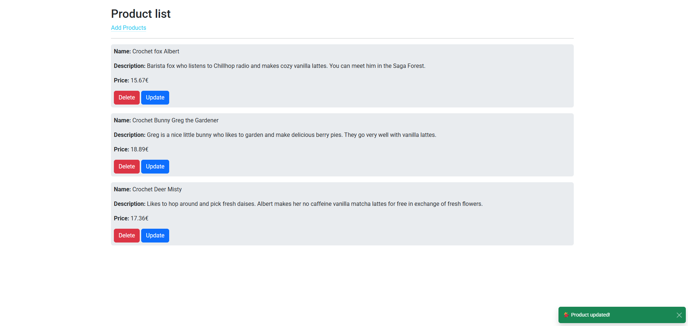

# 🌱 Product Manager App with MySQL + Express + HTML 🛍️

Welcome to your full-stack product manager built with **Express.js**, **MySQL**, and a slick **HTML/Bootstrap** frontend.  
This project lets you **create**, **read**, **update**, and **delete** products from a local MySQL database – all with real-time feedback and Bootstrap-powered forms and modals.

---

## ✨ Features

- 📦 View all products
- 🔍 Get product by ID (via UI or direct API call)
- 🆕 Add new products with form validation
- 🔄 Update existing product via modal popup
- ❌ Delete product with instant UI update
- 🚨 Custom error messages and fallback route
- 💅 Styled with Bootstrap 5
- ⚙️ Organized using MVC-inspired structure

---

## ⚙️ Setup & Run

### 1. Clone this repo

```bash
git clone https://github.com/your-username/mysql-express-product-app.git
cd mysql-express-product-app
```

### 2. Install dependencies

```bash
npm install
```

### 3. Create your .env file

```env
DB_HOST=127.0.0.1
DB_USER=root
DB_PASSWORD=yourpassword
DB_NAME=first_db
```

### 4. Create the MySQL database

```sql
CREATE DATABASE first_db;

USE first_db;

CREATE TABLE products (
  id INT AUTO_INCREMENT PRIMARY KEY,
  title VARCHAR(255) NOT NULL,
  price DECIMAL(10,2) NOT NULL,
  description TEXT NOT NULL
);
```

### 5. Start the server

```bash
npm run dev
```

Server will run on:
👉 http://localhost:3000
Frontend UI:
👉 file:///path/to/project/page/index.html

## 📦 Product API Endpoints

No need for Postman or Thunder Client – it’s all clicky-clicky in html 😎

### GET all products

```http
GET /products
```

### GET product by ID

```http
GET /products/:id
```

### POST new product

```http
POST /products
Content-Type: application/json

{
  "title": "Crochet Fox",
  "price": 15.99,
  "description": "Barista fox who chills in the Saga Forest"
}
```

### PUT update product

```http
PUT /products/:id
Content-Type: application/json

{
  "price": 18.99
}
```

### DELETE product

```http
DELETE /products/:id
```

## 🌟 Live Features

- 🧠 Uses fetch() to interact with the API
- 🧼 Sanitized inputs and friendly errors
- 📦 Automatically updates the page on any data change
- 🔁 Reusable modal popup for editing products

## 🔐 Environment Protection

Sensitive data like your DB password is hidden using dotenv.
Make sure your .env file is in .gitignore.

## 🖼️ Preview

Here’s a sneak peek of the UI:



## 🛠️ Future Improvements

- ✅ Add product image support (upload or link)
- 🗄️ Connect to a cloud MySQL DB
- 🌐 Add pagination or search
- 🧑‍🤝‍🧑 Add user authentication and roles
- 📱 Build a mobile app version
- 🧪 Add unit & integration tests
- 🧙‍♀️ Dark mode toggle (for the vibes)

## 📜 License

MIT © Rainy
